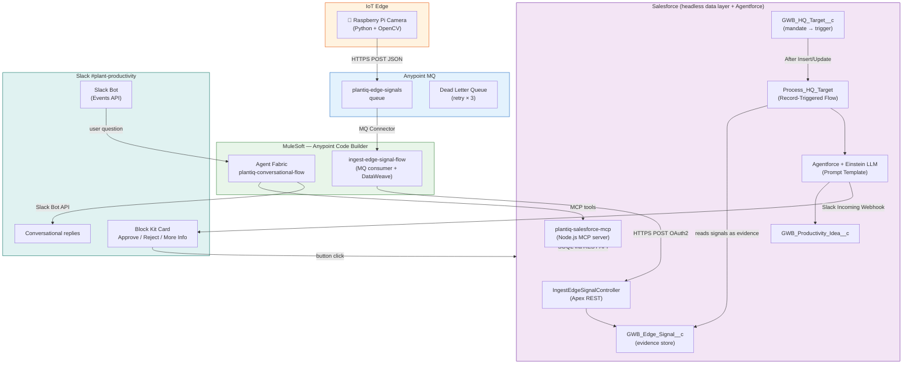
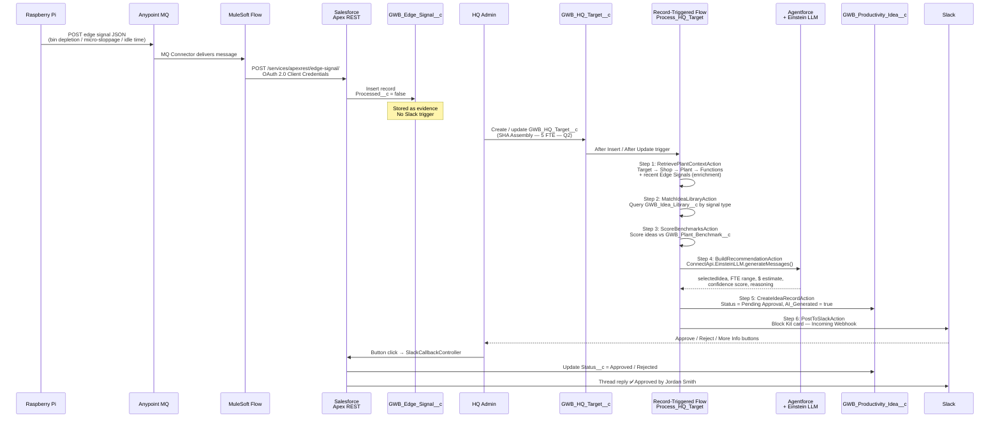
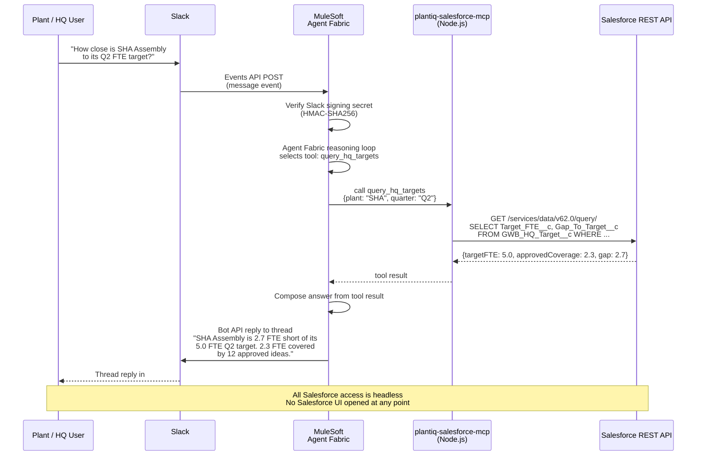
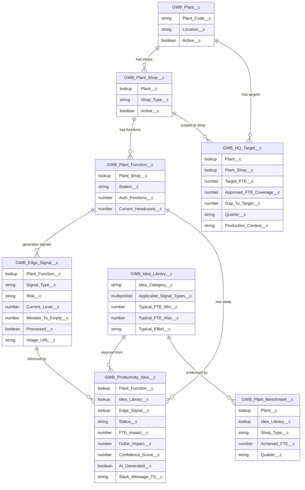
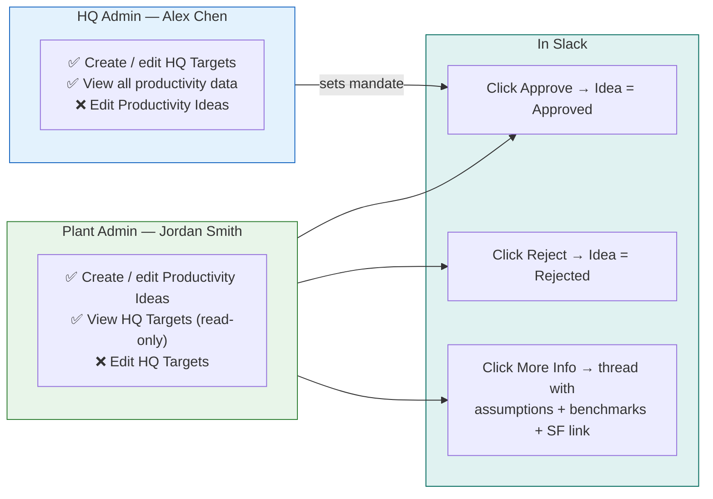

# PlantIQ — Architecture Diagrams

Two AI patterns share a single Salesforce data layer and a single Slack workspace.

---

## High-Level System Map

---

## Pattern 1 — IoT Pipeline + HQ-Triggered Recommendation

---

## Pattern 2 — Conversational Q&A (Headless Salesforce)

---

## Data Model Relationships

---

## Key Roles & Access

